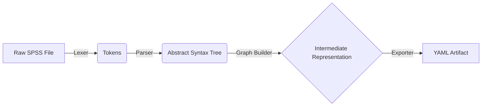

# SpecGen: Legacy SPSS to Modern ETL Compiler


> **A semantic compiler that reverse-engineers legacy SPSS syntax into a platform-agnostic Intermediate Representation (IR).**

`SpecGen` is not a transpiler; it is a **logic extractor**. It parses legacy scripts, builds a dependency graph of data transformations, and exports a clean YAML specification that can be used to generate SQL, R, or PySpark pipelines.

---

## 🏗 Architecture

The project follows a strict **Compiler Frontend** architecture, designed to separate syntax parsing from semantic understanding.



### 1. The Ingestion Layer

* **Lexer (`src/importers/spss/lexer.py`):** A robust tokenizer that handles SPSS-specific quirks (e.g., trailing dots, case insensitivity) using strict Regex definitions.
* **Parser (`src/importers/spss/parser.py`):** A recursive descent parser that converts tokens into a type-safe **Abstract Syntax Tree (AST)**.
* *Feature:* **"Fugue State" Processing** — Automatically detects and ignores inline raw data blocks (`BEGIN DATA` ... `END DATA`) to prevent parser hallucinations.
* *Feature:* **Semantic Capture** — Parses complex `AGGREGATE` and `MATCH FILES` commands into structured objects, not generic text.


### 2. The Semantic Layer

* **Graph Builder (`src/importers/spss/graph_builder.py`):** converts the linear AST into a Directed Acyclic Graph (DAG) of operations.
* **Data Lineage:** Tracks dataset state across Joins, Filters, and Aggregations.
* **Deterministic IDs:** Generates stable IDs for datasets and operations, ensuring consistent output across runs.


### 3. The Validation Layer (`src/ir`)

* **Pydantic Models:** Enforces strict typing on the IR.
* **Self-Healing:** Automatically detects cycles in the graph and validates that all inputs/outputs reference existing datasets.

---

## 🚀 Getting Started

### Prerequisites

* Python 3.12+
* `pydantic`, `networkx`, `pyyaml`

### Installation

```bash
git clone https://github.com/your-repo/spec_generator.git
cd spec_generator
pip install -r requirements.txt

```

### Usage

Run the compiler against any SPSS syntax file:

```bash
PYTHONPATH=src:. python cli.py path/to/script.sps

```

This will generate a `pipeline_spec.yaml` in the output directory.

---

## 🧪 Testing Strategy

This project maintains **96% Code Coverage** and employs a multi-tiered testing strategy:

1. **Unit Tests (`tests/unit`):** Isolate specific components (e.g., verifying `AGGREGATE` parsing handles lists correctly).
2. **Integration Tests (`tests/integration`):** Validate the full pipeline lifecycle.
* `test_advanced_scenarios.py`: The "Kitchen Sink" test that runs Load -> Compute -> Filter -> Aggregate -> Join -> Save.


3. **Technical Debt Tracking (`test_pending_features.py`):** A suite of tests designed to *document* missing features. These tests assert that commands like `RECODE` are currently "Generic," serving as a reminder for future development.

**Run the full suite:**

```bash
PYTHONPATH=src:. pytest --cov=src --cov-report=term-missing

```

---

## 📂 Project Structure

```text
src/
├── importers/spss/      # The Compiler Frontend
│   ├── grammar.py       # Regex definitions for Tokens
│   ├── lexer.py         # Tokenizer logic
│   ├── ast.py           # AST Node definitions (ComputeNode, AggregateNode, etc.)
│   ├── parser.py        # Recursive Descent Parser
│   └── graph_builder.py # Logic for transforming AST -> IR Graph
├── ir/                  # Intermediate Representation
│   ├── model.py         # Pydantic models (Pipeline, Operation, Dataset)
│   └── types.py         # Enums (OpType, DataType)
└── exporters/           # Backend Code Generators
    └── yaml.py          # Serializes the IR to YAML

```

---

## 🔮 Roadmap & Technical Debt

While the compiler is robust for core ETL tasks, advanced statistical transformations are currently treated as "Black Boxes."

| Feature | Status | Notes |
| --- | --- | --- |
| **Logic & Math** | ✅ Complete | Full support for `COMPUTE`, `IF`, `SELECT IF`. |
| **Aggregation** | ✅ Complete | White-box support for `BREAK` variables and formulas. |
| **Joins** | ✅ Complete | Support for `MATCH FILES` / `STAR JOIN`. |
| **Raw Data** | ✅ Complete | Safely ignores `BEGIN DATA` blocks. |
| *RECODE* | ⚠️ Generic | Currently parsed as a generic passthrough. |
| *DATA LIST* | ⚠️ Generic | Implicit schema definition not yet fully captured. |

---

## 📝 Example Output

Input SPSS:

```spss
AGGREGATE /OUTFILE=* /BREAK=region /total = SUM(sales).

```

Output YAML (IR):

```yaml
- id: op_020_aggregate
  type: aggregate
  inputs: [ds_019]
  outputs: [ds_020]
  parameters:
    outfile: '*'
    break: ['region']
    aggregations: ['TOTAL = SUM(SALES)']

```
