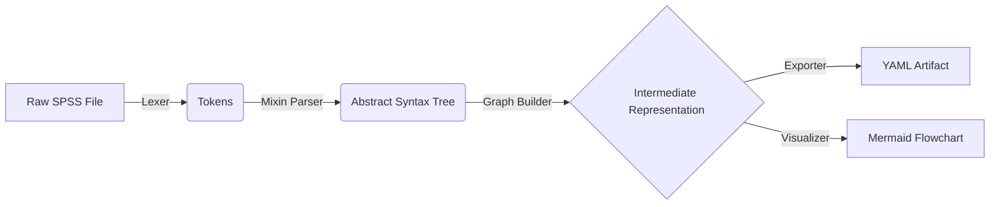

# SpecGen: Legacy SPSS to Modern ETL Compiler

> **A semantic compiler that reverse-engineers legacy SPSS syntax into a platform-agnostic Intermediate Representation (IR).**

SpecGen is not a simple transpiler. It is a **logic extractor**. It parses legacy scripts, builds a dependency graph of data transformations, tracks variable lineage through complex logic, and exports a clean specification that can be used to generate SQL, R, or PySpark pipelines.

---

## 📝 Executive Summary

**SpecGen** solves the "Black Box" problem of legacy migration. Unlike line-by-line translation tools, SpecGen builds a **Dependency Graph** of the data lifecycle, ensuring that the business logic is understood before it is migrated.

### Core Capabilities

* **Semantic Schema Propagation:** The compiler tracks the existence and type of every variable at every step. It accurately predicts output columns (e.g., `TOTAL_PAID` from an `AGGREGATE`), even if those columns rely on variables created 20 steps earlier.
* **Robust "Ghost Column" Detection:** Structural commands like `RECODE` are parsed to identify implicit variable creation (`RECODE x INTO y`). This prevents downstream failures where queries attempt to use variables that "don't exist" in the schema.
* **Hybrid Parsing Strategy:**
* **White Box:** Critical ETL commands (`AGGREGATE`, `JOIN`, `FILTER`, `COMPUTE`) are fully parsed into semantic logic.
* **Gray Box:** Complex transformations (`RECODE`) are parsed for **Structure** (Inputs/Outputs) to maintain schema integrity, while preserving logic for manual review.


---

## 🏗 Architecture

The project follows a strict **Compiler Frontend** architecture, designed to separate syntax parsing from semantic understanding.



### 1. The Modular Parser (`spec_generator.importers/spss/parsers/`)

We moved away from a monolithic parser to a **Mixin-based Facade Pattern**:

* `schema.py`: Handles `DATA LIST`, `GET DATA`, and variable definitions.
* `stats.py`: Handles complex `AGGREGATE` logic and break variables.
* `logic.py`: Handles `RECODE` and `COMPUTE` structure.
* `base.py`: Shared token navigation and state management.

### 2. The Semantic Graph Builder

Converts the linear AST into a Directed Acyclic Graph (DAG).

* **State Accumulation:** It "remembers" the columns in the dataset at step  to validate step .
* **Optimistic Typing:** Handles "Ghost Columns" created by generic transformations by inferring their existence to prevent pipeline breakage.

### 3. The Validation Layer

* **96% Test Coverage:** Validated against a 60-step complex ETL pipeline simulating real-world Benefit Data processing.
* **Determinism:** Output IDs (`ds_001`, `op_058`) are stable and reproducible.

---

## 🚀 Getting Started

### Prerequisites

* Python 3.12+
* `pydantic`, `networkx`, `pyyaml`

### Installation

```bash
git clone https://github.com/your-repo/spec_generator.git
cd spec_generator
pip install -r requirements.txt

```

### Usage

**1. Generate the Specification (YAML):**

```bash
PYTHONPATH=src:. python cli.py inputs/my_script.sps

```

*Outputs: `inputs/my_script.yaml*`

**2. Generate the Data Flow Diagram (Mermaid):**

```bash
PYTHONPATH=src:. python cli.py inputs/my_script.sps --visualize

```

*Outputs: `inputs/my_script.md` (Viewable in GitHub or Mermaid Live)*

---

## 🔍 Example: The "Ghost Column" Problem

One of the hardest challenges in migration is when a variable is created implicitly and used later. SpecGen handles this automatically.

**Input SPSS:**

```spss
DATA LIST FREE / age (F3.0).
* RECODE creates 'is_adult' implicitly!
RECODE age (18 thru 100 = 1) (ELSE = 0) INTO is_adult.
AGGREGATE
  /OUTFILE=*
  /BREAK=is_adult
  /count = N.

```

**Output YAML (IR):**
SpecGen detects `is_adult` was created, registers it in the schema, and validates the Aggregation.

```yaml
- id: op_002_recode
  type: compute
  inputs: [ds_001]
  outputs: [ds_002_derived]
  parameters:
    targets: ['is_adult']  # <--- Captured!
    logic: '( 18 thru 100 = 1 ) ( ELSE = 0 )'

- id: op_003_aggregate
  type: aggregate
  inputs: [ds_002_derived]
  outputs: [ds_003_agg_active]
  parameters:
    break: ['is_adult']    # <--- Validated against schema!
    aggregations: ['count = N']

```

---

## 📂 Project Structure

```text
src/
├── importers/spss/
│   ├── ast.py                # Node definitions
│   ├── graph_builder.py      # Logic builder (The "Brain")
│   ├── lexer.py              # Tokenizer
│   ├── parser.py             # The Main Facade
│   ├── parsers/              # Specialized Logic Modules
│   │   ├── base.py
│   │   ├── schema.py         # DATA LIST / GET DATA
│   │   ├── stats.py          # AGGREGATE
│   │   └── logic.py          # RECODE / COMPUTE
│   └── tokens.py
├── ir/                       # Intermediate Representation
│   ├── model.py              # Pydantic models (Pipeline, Operation)
│   └── types.py              # Enums (OpType, DataType)
└── exporters/
    ├── yaml.py               # Serializes IR to YAML
    └── mermaid.py            # Visualizes IR as Flowchart

```

---

## 🔮 Roadmap

| Feature | Status | Notes |
| --- | --- | --- |
| **Logic & Math** | ✅ Complete | Full support for `COMPUTE`, `IF`, `RECODE`. |
| **Aggregation** | ✅ Complete | White-box support for `BREAK` variables and formulas. |
| **Joins** | ✅ Complete | Support for `MATCH FILES` / `STAR JOIN`. |
| **Schema Tracking** | ✅ Complete | Tracks column creation and types across the graph. |
| **Control Flow** | ⚠️ Generic | `DO REPEAT` is currently flattened linearly. |
| **SQL Generation** | 🚧 Next Up | Converting IR Node `op_aggregate` -> `GROUP BY`. |

---

