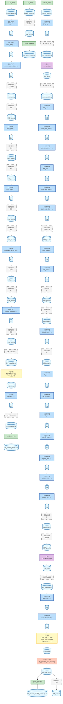

```mermaid
graph TD
    classDef dataset fill:#e1f5fe,stroke:#01579b,stroke-width:2px,rx:5,ry:5;
    classDef op_load fill:#c8e6c9,stroke:#2e7d32,stroke-width:2px;
    classDef op_save fill:#c8e6c9,stroke:#2e7d32,stroke-width:2px;
    classDef op_compute fill:#bbdefb,stroke:#0d47a1,stroke-width:2px;
    classDef op_filter fill:#fff9c4,stroke:#fbc02d,stroke-width:2px;
    classDef op_agg fill:#ffccbc,stroke:#d84315,stroke-width:2px;
    classDef op_join fill:#e1bee7,stroke:#4a148c,stroke-width:2px;
    classDef op_generic fill:#f5f5f5,stroke:#616161,stroke-width:2px,stroke-dasharray: 5 5;
    source_control_vars.csv[("control_vars.csv")]:::dataset
    ds_001_derived[("001")]:::dataset
    ds_002_derived[("002")]:::dataset
    ds_003_derived[("003")]:::dataset
    ds_004_generic[("004_generic")]:::dataset
    ds_005_generic[("005_generic")]:::dataset
    ds_006_derived[("006")]:::dataset
    ds_007_generic[("007_generic")]:::dataset
    ds_008_generic[("008_generic")]:::dataset
    ds_009_derived[("009")]:::dataset
    ds_010_generic[("010_generic")]:::dataset
    ds_011_generic[("011_generic")]:::dataset
    ds_012_derived[("012")]:::dataset
    ds_013_generic[("013_generic")]:::dataset
    ds_014_generic[("014_generic")]:::dataset
    ds_015_derived[("015")]:::dataset
    ds_016_generic[("016_generic")]:::dataset
    ds_017_materialized[("017_materialized")]:::dataset
    ds_018_filtered[("018_filtered")]:::dataset
    ds_019_derived[("019")]:::dataset
    ds_020_materialized[("020_materialized")]:::dataset
    file_control_values.sav[("file_control_values.sav")]:::dataset
    source_benefit_rates.csv[("benefit_rates.csv")]:::dataset
    ds_021_generic[("021_generic")]:::dataset
    file_benefit_rates.sav[("file_benefit_rates.sav")]:::dataset
    source_claims_data.csv[("claims_data.csv")]:::dataset
    ds_022_derived[("022")]:::dataset
    ds_023_materialized[("023_materialized")]:::dataset
    ds_024_joined[("024_joined")]:::dataset
    ds_025_materialized[("025_materialized")]:::dataset
    ds_026_derived[("026")]:::dataset
    ds_027_derived[("027")]:::dataset
    ds_028_derived[("028")]:::dataset
    ds_029_derived[("029")]:::dataset
    ds_030_derived[("030")]:::dataset
    ds_031_derived[("031")]:::dataset
    ds_032_generic[("032_generic")]:::dataset
    ds_033_derived[("033")]:::dataset
    ds_034_derived[("034")]:::dataset
    ds_035_generic[("035_generic")]:::dataset
    ds_036_generic[("036_generic")]:::dataset
    ds_037_derived[("037")]:::dataset
    ds_038_generic[("038_generic")]:::dataset
    ds_039_derived[("039")]:::dataset
    ds_040_derived[("040")]:::dataset
    ds_041_derived[("041")]:::dataset
    ds_042_derived[("042")]:::dataset
    ds_043_derived[("043")]:::dataset
    ds_044_derived[("044")]:::dataset
    ds_045_derived[("045")]:::dataset
    ds_046_generic[("046_generic")]:::dataset
    ds_047_generic[("047_generic")]:::dataset
    ds_048_joined[("048_joined")]:::dataset
    ds_049_materialized[("049_materialized")]:::dataset
    ds_050_derived[("050")]:::dataset
    ds_051_derived[("051")]:::dataset
    ds_052_filtered[("052_filtered")]:::dataset
    ds_053_agg_active[("053_agg_active")]:::dataset
    file_benefit_monthly_summary.csv[("file_benefit_monthly_summary.csv")]:::dataset
    ds_054_generic[("054_generic")]:::dataset
    op_001_load["LOAD_CSV"]:::op_load
    op_001_load --> source_control_vars.csv
    op_002_compute["COMPUTE<br/>min_age_n = ..."]:::op_compute
    source_control_vars.csv --> op_002_compute
    op_002_compute --> ds_001_derived
    op_003_compute["COMPUTE<br/>max_age_n = ..."]:::op_compute
    ds_001_derived --> op_003_compute
    op_003_compute --> ds_002_derived
    op_004_compute["COMPUTE<br/>reference_month_n = ..."]:::op_compute
    ds_002_derived --> op_004_compute
    op_004_compute --> ds_003_derived
    op_005_generic["GENERIC<br/>STRING"]:::op_generic
    ds_003_derived --> op_005_generic
    op_005_generic --> ds_004_generic
    op_006_generic["GENERIC<br/>DO"]:::op_generic
    ds_004_generic --> op_006_generic
    op_006_generic --> ds_005_generic
    op_007_compute["COMPUTE<br/>min_age_n = ..."]:::op_compute
    ds_005_generic --> op_007_compute
    op_007_compute --> ds_006_derived
    op_008_generic["GENERIC<br/>END"]:::op_generic
    ds_006_derived --> op_008_generic
    op_008_generic --> ds_007_generic
    op_009_generic["GENERIC<br/>DO"]:::op_generic
    ds_007_generic --> op_009_generic
    op_009_generic --> ds_008_generic
    op_010_compute["COMPUTE<br/>max_age_n = ..."]:::op_compute
    ds_008_generic --> op_010_compute
    op_010_compute --> ds_009_derived
    op_011_generic["GENERIC<br/>END"]:::op_generic
    ds_009_derived --> op_011_generic
    op_011_generic --> ds_010_generic
    op_012_generic["GENERIC<br/>DO"]:::op_generic
    ds_010_generic --> op_012_generic
    op_012_generic --> ds_011_generic
    op_013_compute["COMPUTE<br/>reference_month_n = ..."]:::op_compute
    ds_011_generic --> op_013_compute
    op_013_compute --> ds_012_derived
    op_014_generic["GENERIC<br/>END"]:::op_generic
    ds_012_derived --> op_014_generic
    op_014_generic --> ds_013_generic
    op_015_generic["GENERIC<br/>DO"]:::op_generic
    ds_013_generic --> op_015_generic
    op_015_generic --> ds_014_generic
    op_016_compute["COMPUTE<br/>exclude_status_s = ..."]:::op_compute
    ds_014_generic --> op_016_compute
    op_016_compute --> ds_015_derived
    op_017_generic["GENERIC<br/>END"]:::op_generic
    ds_015_derived --> op_017_generic
    op_017_generic --> ds_016_generic
    op_018_exec["MATERIALIZE"]:::op_generic
    ds_016_generic --> op_018_exec
    op_018_exec --> ds_017_materialized
    op_019_filter["FILTER<br/>NOT MISSING ( min_age_n )"]:::op_filter
    ds_017_materialized --> op_019_filter
    op_019_filter --> ds_018_filtered
    op_020_compute["COMPUTE<br/>join_key = ..."]:::op_compute
    ds_018_filtered --> op_020_compute
    op_020_compute --> ds_019_derived
    op_021_exec["MATERIALIZE"]:::op_generic
    ds_019_derived --> op_021_exec
    op_021_exec --> ds_020_materialized
    op_022_save["SAVE_BINARY"]:::op_save
    ds_020_materialized --> op_022_save
    op_022_save --> file_control_values.sav
    op_023_load["LOAD_CSV"]:::op_load
    op_023_load --> source_benefit_rates.csv
    op_024_generic["GENERIC<br/>SORT"]:::op_generic
    source_benefit_rates.csv --> op_024_generic
    op_024_generic --> ds_021_generic
    op_025_save["SAVE_BINARY"]:::op_save
    ds_021_generic --> op_025_save
    op_025_save --> file_benefit_rates.sav
    op_026_load["LOAD_CSV"]:::op_load
    op_026_load --> source_claims_data.csv
    op_027_compute["COMPUTE<br/>join_key = ..."]:::op_compute
    source_claims_data.csv --> op_027_compute
    op_027_compute --> ds_022_derived
    op_028_exec["MATERIALIZE"]:::op_generic
    ds_022_derived --> op_028_exec
    op_028_exec --> ds_023_materialized
    op_029_join["JOIN<br/>On: join_key"]:::op_join
    ds_023_materialized --> op_029_join
    op_029_join --> ds_024_joined
    op_030_exec["MATERIALIZE"]:::op_generic
    ds_024_joined --> op_030_exec
    op_030_exec --> ds_025_materialized
    op_031_compute["COMPUTE<br/>dob_num = ..."]:::op_compute
    ds_025_materialized --> op_031_compute
    op_031_compute --> ds_026_derived
    op_032_compute["COMPUTE<br/>claim_start_num = ..."]:::op_compute
    ds_026_derived --> op_032_compute
    op_032_compute --> ds_027_derived
    op_033_compute["COMPUTE<br/>claim_end_num = ..."]:::op_compute
    ds_027_derived --> op_033_compute
    op_033_compute --> ds_028_derived
    op_034_compute["COMPUTE<br/>dob_date = ..."]:::op_compute
    ds_028_derived --> op_034_compute
    op_034_compute --> ds_029_derived
    op_035_compute["COMPUTE<br/>claim_start_date = ..."]:::op_compute
    ds_029_derived --> op_035_compute
    op_035_compute --> ds_030_derived
    op_036_compute["COMPUTE<br/>claim_end_date = ..."]:::op_compute
    ds_030_derived --> op_036_compute
    op_036_compute --> ds_031_derived
    op_037_generic["GENERIC<br/>FORMATS"]:::op_generic
    ds_031_derived --> op_037_generic
    op_037_generic --> ds_032_generic
    op_038_compute["COMPUTE<br/>age_years = ..."]:::op_compute
    ds_032_generic --> op_038_compute
    op_038_compute --> ds_033_derived
    op_039_compute["COMPUTE<br/>age_valid = ..."]:::op_compute
    ds_033_derived --> op_039_compute
    op_039_compute --> ds_034_derived
    op_040_generic["GENERIC<br/>IF"]:::op_generic
    ds_034_derived --> op_040_generic
    op_040_generic --> ds_035_generic
    op_041_generic["GENERIC<br/>IF"]:::op_generic
    ds_035_generic --> op_041_generic
    op_041_generic --> ds_036_generic
    op_042_compute["COMPUTE<br/>status_valid = ..."]:::op_compute
    ds_036_generic --> op_042_compute
    op_042_compute --> ds_037_derived
    op_043_generic["GENERIC<br/>IF"]:::op_generic
    ds_037_derived --> op_043_generic
    op_043_generic --> ds_038_generic
    op_044_compute["COMPUTE<br/>ref_year = ..."]:::op_compute
    ds_038_generic --> op_044_compute
    op_044_compute --> ds_039_derived
    op_045_compute["COMPUTE<br/>ref_month = ..."]:::op_compute
    ds_039_derived --> op_045_compute
    op_045_compute --> ds_040_derived
    op_046_compute["COMPUTE<br/>month_start = ..."]:::op_compute
    ds_040_derived --> op_046_compute
    op_046_compute --> ds_041_derived
    op_047_compute["COMPUTE<br/>month_end = ..."]:::op_compute
    ds_041_derived --> op_047_compute
    op_047_compute --> ds_042_derived
    op_048_compute["COMPUTE<br/>eligible_start = ..."]:::op_compute
    ds_042_derived --> op_048_compute
    op_048_compute --> ds_043_derived
    op_049_compute["COMPUTE<br/>eligible_end = ..."]:::op_compute
    ds_043_derived --> op_049_compute
    op_049_compute --> ds_044_derived
    op_050_compute["COMPUTE<br/>eligible_days = ..."]:::op_compute
    ds_044_derived --> op_050_compute
    op_050_compute --> ds_045_derived
    op_051_generic["GENERIC<br/>IF"]:::op_generic
    ds_045_derived --> op_051_generic
    op_051_generic --> ds_046_generic
    op_052_generic["GENERIC<br/>SORT"]:::op_generic
    ds_046_generic --> op_052_generic
    op_052_generic --> ds_047_generic
    op_053_join["JOIN<br/>On: benefit_type"]:::op_join
    ds_047_generic --> op_053_join
    op_053_join --> ds_048_joined
    op_054_exec["MATERIALIZE"]:::op_generic
    ds_048_joined --> op_054_exec
    op_054_exec --> ds_049_materialized
    op_055_compute["COMPUTE<br/>daily_rate = ..."]:::op_compute
    ds_049_materialized --> op_055_compute
    op_055_compute --> ds_050_derived
    op_056_compute["COMPUTE<br/>payment_amount = ..."]:::op_compute
    ds_050_derived --> op_056_compute
    op_056_compute --> ds_051_derived
    op_057_filter["FILTER<br/>( age_valid = 1 AND status_valid = 1 AND eligible_days > 0 )"]:::op_filter
    ds_051_derived --> op_057_filter
    op_057_filter --> ds_052_filtered
    op_058_aggregate["AGGREGATE<br/>By: ['benefit_type', 'region']"]:::op_agg
    ds_052_filtered --> op_058_aggregate
    op_058_aggregate --> ds_053_agg_active
    op_059_save["SAVE_BINARY"]:::op_save
    ds_053_agg_active --> op_059_save
    op_059_save --> file_benefit_monthly_summary.csv
    op_060_generic["GENERIC<br/>LIST"]:::op_generic
    ds_053_agg_active --> op_060_generic
    op_060_generic --> ds_054_generic
```